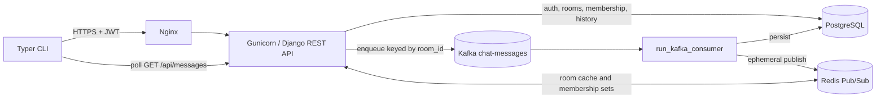
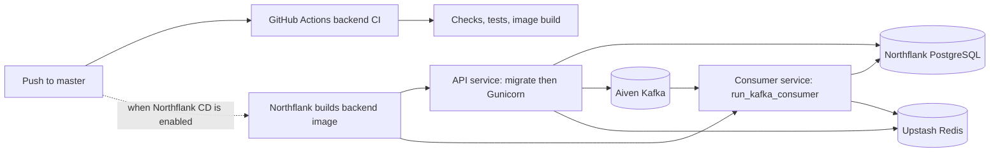

# Chat Pulse architecture

This document describes the executable repository state as inspected on 2026-09-05.
Where older README claims differ, code and deployment configuration are authoritative.

## Component map

Redis Pub/Sub currently has no subscriber implemented in this repository. Interactive
chat feels live because `cli/chatpulse_cli/chat.py` polls message history (two seconds
by default) in a background thread.

## Synchronous HTTP paths

Registration validates Django password rules and creates the custom `User`. Login is
SimpleJWT token issuance plus `is_online=True`; refresh uses SimpleJWT's public token
refresh view; logout blacklists the supplied refresh token and sets `is_online=False`.
JWT-authenticated `/me/` returns the current user.

Room creation writes the room and creator membership to PostgreSQL, then updates Redis.
Join/leave similarly mutate PostgreSQL before updating Redis. A creator leaving deletes
the room, whose memberships and messages cascade. These operations are not wrapped in
an explicit transaction and Redis errors currently propagate, so the client can receive
an error after the database mutation succeeded.

Room history authorizes against `RoomMembership` in PostgreSQL, queries messages with
their sender, and implements an ID cursor with `before_id`. Query parameters are parsed
directly in views and are not yet robust against invalid integers or negative limits.

## Asynchronous message path

1. `POST /api/messages/send/` validates content and checks room/membership using Redis
   with PostgreSQL fallback on cache miss.
2. The view creates a payload and calls the process-global confluent-kafka producer,
   keyed by room ID.
3. `produce_message()` enqueues locally and calls `poll(0)`; the API returns `202` before
   a delivery callback confirms broker acknowledgement.
4. `run_kafka_consumer` polls with auto-commit disabled.
5. The consumer resolves the room and sender, then uses Kafka offset to `get_or_create`
   a `Message`.
6. It publishes a JSON event to Redis channel `room:{room_id}` and commits the Kafka
   record.

The consumer is at-least-once across crashes because it commits after side effects.
Database deduplication is incomplete for a multi-partition topic because offsets are
partition-scoped but the schema stores only the offset. Redis publication may repeat
after a crash or Redis failure and is not durable.

## Target deployment path

The EC2/VPS deployment is retired. The GitHub workflow no longer publishes or deploys
an image; Northflank combined services are the planned build/deploy owner. The API and
consumer use the same Dockerfile, but Northflank runs them as two services. The API
entrypoint runs migrations before Gunicorn; the consumer command override bypasses
migrations. A private Northflank PostgreSQL add-on is the system of record. Northflank
terminates public TLS, so Nginx is not part of this target path.

This target has been prepared but not provisioned or externally verified. See
[free-tier-deployment.md](free-tier-deployment.md) and
[deployment-runbook.md](deployment-runbook.md).
